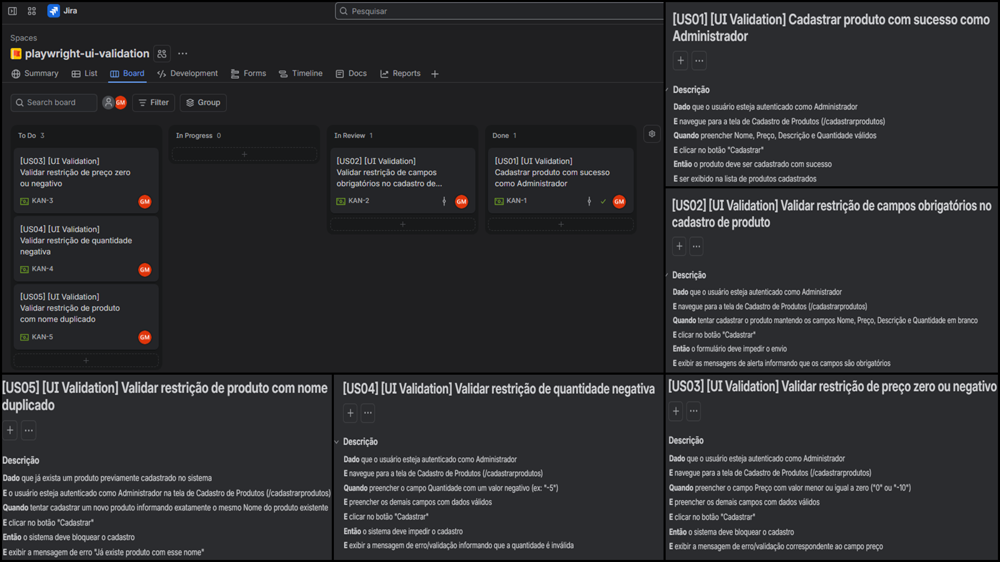

# Playwright UI Validation - Validação de Entradas em Cadastros

Projeto de automação de testes End-to-End (E2E) focado no módulo de **Cadastro de Produtos** da aplicação web **Serverest**, aplicando técnicas formais de teste de software do ISTQB (**Partição de Equivalência** e **Análise de Valor Limite**), especificações em formato **BDD (Gherkin)** e gestão ágil integrada ao **Jira Software**.

## Objetivo

Garantir a integridade, resiliência e correto bloqueio de entradas inválidas nos formulários de cadastro de produtos da interface gráfica (perfil Administrador), assegurando a validação de campos obrigatórios, restrições numéricas e unicidade de registros.

## Tecnologias Utilizadas

- **Playwright** (v1.x)
- **Node.js**
- **JavaScript (ES6+)**
- **Jira Software** (Kanban / Automation Rules)
- **Git / GitHub** (GitHub for Jira Integration)

## Gestão do Projeto e Rastreabilidade Ágil (Jira Software + GitHub)

O planejamento, especificação e ciclo de vida das tarefas foram gerenciados no **Jira Software** integrado ao **GitHub**:

- **Integração DevOps:** Conexão nativa do repositório GitHub ao Jira Software via aplicativo *GitHub for Jira*.
- **Rastreabilidade por Ticket:** Todas as branches e mensagens de commit possuem a chave da História de Usuário (ex: `KAN-1`, `KAN-2`, etc.), vinculando automaticamente o histórico de desenvolvimento ao card no Jira.
- **Automação de Workflow (Jira Automation Rules):**
  - *Branch criada no Git* ➔ Ticket transita automaticamente para `In Progress`.
  - *Pull Request criado no GitHub* ➔ Ticket transita automaticamente para `In Review`.
  - *Pull Request mesclado na main* ➔ Ticket transita automaticamente para `Done`.

### Painel de Gestão no Jira Software & Especificações BDD (Gherkin)



## Técnicas de Teste ISTQB Aplicadas

- **Partição de Equivalência (Equivalence Partitioning - EP):** Divisão dos dados em classes válidas (campos preenchidos corretamente) e inválidas (campos obrigatórios mantidos em branco).
- **Análise de Valor Limite (Boundary Value Analysis - BVA):** Teste nas fronteiras numéricas aceitas nos campos Preço (`preco <= 0`) e Quantidade (`quantity < 0`).
- **Validação de Regras de Negócio (Unicidade):** Restrição de cadastros duplicados informando o mesmo Nome de produto.

## Cenários de Teste Automatizados (Histórias de Usuário)

| Ticket Jira | Cenário | Técnica ISTQB / Descrição Técnica |
| :--- | :--- | :--- |
| **US01 / KAN-1** | Cadastrar produto com sucesso como Administrador | **Caminho Feliz.** Valida o cadastro de novo produto com dados válidos por usuário autenticado como Admin (`administrador: 'true'`). |
| **US02 / KAN-2** | Validar restrição de campos obrigatórios | **Partição de Equivalência (EP).** Submete o formulário em branco e valida os 4 alertas obrigatórios (Nome, Preço, Descrição, Quantidade). |
| **US03 / KAN-3** | Validar restrição de preço zero ou negativo | **Análise de Valor Limite (BVA).** Preenche o campo preço com valor negativo (`-1`) e valida a mensagem de bloqueio `Preco deve ser um número positivo`. |
| **US04 / KAN-4** | Validar restrição de quantidade negativa | **Análise de Valor Limite (BVA).** Preenche o campo quantidade com valor negativo (`-10`) e valida a mensagem `Quantidade deve ser maior ou igual a 0`. |
| **US05 / KAN-5** | Validar restrição de produto com nome duplicado | **Regra de Negócio (Unicidade).** Tenta cadastrar um 2º produto com nome idêntico a um existente e valida o bloqueio `Já existe produto com esse nome`. |

## Destaques Técnicos e Arquitetura

- **Bypass de Autenticação em Background (API):** Cadastro (`POST /usuarios`) e login (`POST /login`) silenciosos via API REST para perfil Admin com injeção de token JWT no `localStorage`, isolando o foco do teste para a tela sob validação.
- **Upload de Imagem em Memória via Buffer:** Envio de imagens para o campo `<input type="file">` sem dependências de arquivos locais físicos utilizando `Buffer.from(...)` base64.
- **Desaceleração Visual Global (`slowMo`):** Configuração de `slowMo: 500` no `playwright.config.js` para acompanhamento visual no modo `--headed` sem poluir a suíte de testes com chamadas `waitForTimeout`.
- **Massa de Dados Dinâmica Incremental:** Uso do `counter.json` para geração autônoma de usuários e nomes de produtos únicos a cada execução.

## Estrutura do Projeto

```text
├── docs/
│   └── assets/
│       └── print-jira-details.png     # Painel de evidências do Jira & BDD
├── tests/
│   └── product-validation.spec.js     # Suíte de testes E2E de Validações de Formulário
├── counter.json                       # Persistência de contador incremental de massa
├── playwright.config.js               # Configurações globais do Playwright (slowMo, etc.)
├── package.json                       # Dependências e scripts do projeto
└── .gitignore                         # Arquivos ignorados pelo Git
```

## Pré-requisitos

- **Node.js** (versão 18 ou superior)
- **NPM**

## Como Executar os Testes

1. **Clonar o repositório:**
   ```bash
   git clone git@github.com:giovanemedeiros/playwright-ui-validation.git
   cd playwright-ui-validation
   ```

2. **Instalar as dependências:**
   ```bash
   npm install
   ```

3. **Executar a suíte de testes completa (Headless):**
   ```bash
   npx playwright test
   ```

4. **Executar em modo sequencial com interface gráfica (Headed):**
   ```bash
   npx playwright test tests/product-validation.spec.js --project=chromium --headed
   ```

5. **Gerar e abrir o relatório de testes (HTML Report):**
   ```bash
   npx playwright show-report
   ```
